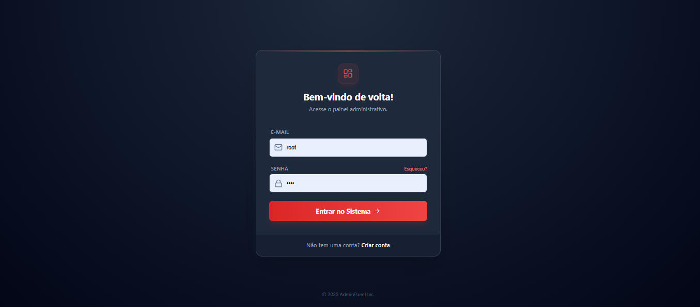
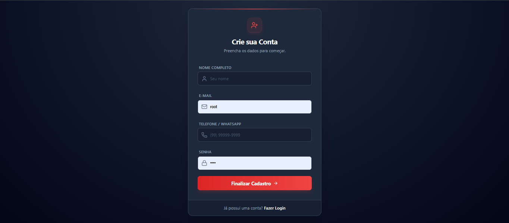
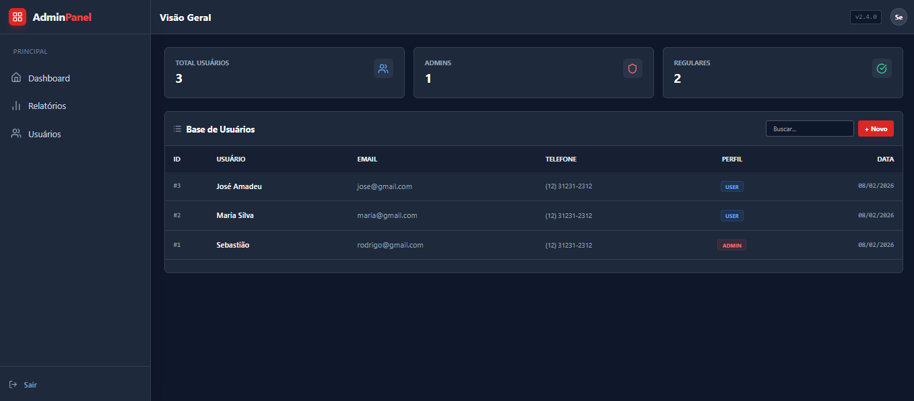

# Laravel Treinamento

Projeto de treinamento em Laravel.

**Pré-requisitos**
- PHP 8.x
- Composer
- Node.js (apenas se for usar React ou Vue)
- NPM

**Rodar o projeto**
```bash
php artisan serve
```





**Se tiver baixado do Git**
1. Instalar dependências PHP
```bash
composer install
```

2. Configurar o `.env`
- Copie o arquivo `.env.example` para `.env` e ajuste as variáveis necessárias.

3. Gerar a chave de criptografia
```bash
php artisan key:generate
```

4. Configurar o banco de dados
```bash
php artisan migrate
```

5. Instalar dependências front-end (se usar React ou Vue)
```bash
npm install
npm run dev
```
